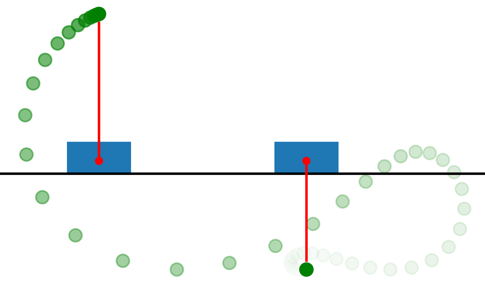

# imitation-learning
Imitation Learning for the Cart-Pole System

This project uses imitation learning to train supervised machine learning models to mimic a Differenetial Dynamic Programming based controller to perform the swing-up maneuver of a cart-pole system. Details on the methodology can be found in the report in the `report` folder. The Python source code is all located in the `src` folder, and the Anaconda YAML file for your environment is also in the root directory.

The trained models are in the `results` folder as split files. You will need to join these files using the `cat` command on a Unix system and then load the file into Python using the Pickle library. An example of this loading is done in the `evaluation.ipynb` Notebook.

The `gen_data.py` file implements DDP and creates the demonstration in a file called `data.csv`, located in the data folder. All the generated figures for the report are kept in the `figures` folder.
